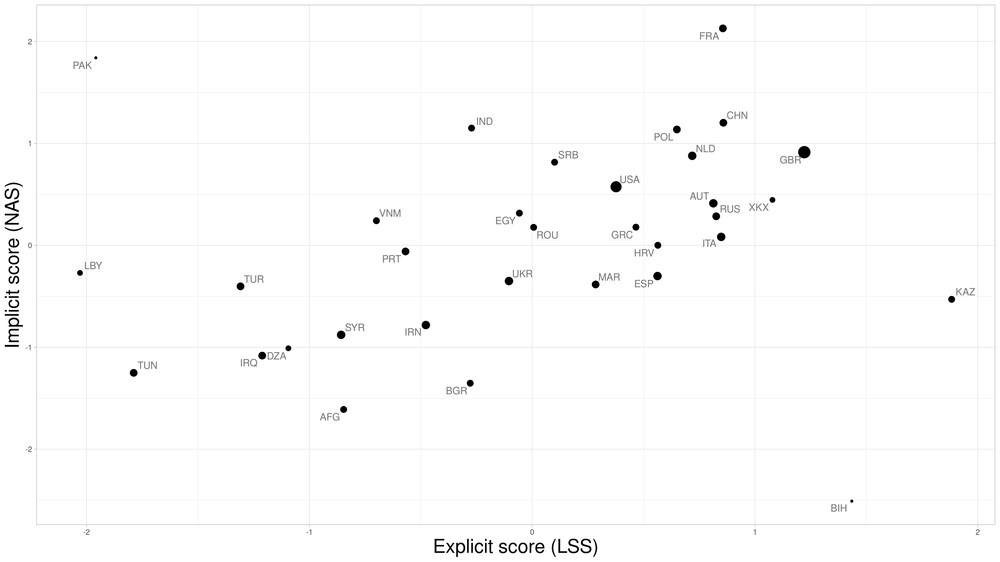

# README



This repository contains the computer code and intermediate data files to reproduce the analyses in "Differential Racism in the News: Using Semi-Supervised Machine Learning to Distinguish Explicit and Implicit Stigmatization of Ethnic and Religious Groups in Journalistic Discourse" (*Political Communication*, doi: [https://doi.org/10.1080/10584609.2023.2193146](https://doi.org/10.1080/10584609.2023.2193146))

## Raw data not shared

Due to copyright issues, we cannot share several files: `../rassmon/all_articles.RData`, `incl_articles.RDS`, `sentences_tibble.RDS`, `parsed_sentences.RDS`. These files contains scraped media content.

`../rassmon/all_articles.RData` is a datadump from [a previous study](https://doi.org/10.1177/19401612211015077) and is a data frame called `alle_Artikel`. It was used only to generate `incl_articles.RDS`, which contains all the relevant articles from it. And then ``../rassmon/all_articles.RData`` is not used anymore.

```r
require(quanteda)
require(tidyverse)
load("../rassmon/all_articles.RData")

## Zeit, Süddeutsche, FAZ, BILD, Die Welt, T-Online, Focus, Spiegel, Tagesspiegel, taz

incl_media <- c("t-online", "focus", "spiegel", "tagesspiegel", "taz", "die-welt", "bild",
                "faz", "sueddeutsche", "zeit")

alle_Artikel %>% filter(from_name %in% incl_media) %>% as_tibble -> incl_articles

incl_articles %>% select(title, from_name, text, pubDate3) %>%
    mutate(publication = from_name, title = title, content = text, date_published = pubDate3) %>%
    select(publication, title, content, date_published) %>% mutate("aid" = row_number()) %>%
    saveRDS("incl_articles.RDS")
```

The structure of a row of data in `incl_articles.RDS`, as output by `dput`, looks like this:

```{r}
library(tibble)
structure(list(publication = "bild", title = "Aue-Stürmer eiskalt - Nazarov jagt Erlers Elfer-Rekord", 
    content = "Aue schwärmt von seinem Elfer-Helden! Sechsmal verwandelte Dimitrij Nazarov (25) eiskalt vom Punkt - zuletzt doppelt gegen 1860 München (3:0). Jetzt jagt Nazarov einen Uralt-Rekord Aues große Stürmer-Legende Holger Erler (67/418 Pflichtspiele mit 99 Toren) gelang das Kunststück, sieben Strafstöße am Stück zu verwandeln. Das war in der Saison 1980/81 in der DDR-Oberliga. Damals vernaschte Erler Torwart-Ikonen wie Bodo Rudwaleit (BFC), Jürgen Croy (Zwickau) und René Müller (Lok). Erler schwärmt von Nazarov! Er sagt: \"Ich bin stolz auf ihn. Das ist klasse, wie er das macht. Die Torhüter haben es schwer. Nazarov schießt total platziert.\" Aue-Legende Holger Erler (l.) Erler stört es nicht, wenn der gebürtige Kasache seinen Rekord nach 36 Jahren knackt: \"Da habe ich überhaupt nichts dagegen, Hauptsache die Jungs halten die Klasse.\" Die Aue-Legende glaubt fest an den Klassenerhalt. Erler: \"Der neue Trainer hat einen entscheidenden Schachzug gemacht: Er hat mit Samson die Abwehr verstärkt. Diese Veränderung war wichtig.\"", 
    date_published = structure(17266, class = "Date"), aid = 20L), row.names = c(NA, 
-1L), class = c("tbl_df", "tbl", "data.frame"))
```

`aid` is the unique identifier of an article.

The tokenized version of `incl_articles.RDS` is `setences_tibble.RDS`. The structure of a row of data in `sentences_tibble.RDS`, as output by `dput`, looks like this:

```{r}
structure(list(publication = "bild", title = "Aue-Stürmer eiskalt - Nazarov jagt Erlers Elfer-Rekord", 
    content = "Aue schwärmt von seinem Elfer-Helden! Sechsmal verwandelte Dimitrij Nazarov (25) eiskalt vom Punkt - zuletzt doppelt gegen 1860 München (3:0). Jetzt jagt Nazarov einen Uralt-Rekord Aues große Stürmer-Legende Holger Erler (67/418 Pflichtspiele mit 99 Toren) gelang das Kunststück, sieben Strafstöße am Stück zu verwandeln. Das war in der Saison 1980/81 in der DDR-Oberliga. Damals vernaschte Erler Torwart-Ikonen wie Bodo Rudwaleit (BFC), Jürgen Croy (Zwickau) und René Müller (Lok). Erler schwärmt von Nazarov! Er sagt: \"Ich bin stolz auf ihn. Das ist klasse, wie er das macht. Die Torhüter haben es schwer. Nazarov schießt total platziert.\" Aue-Legende Holger Erler (l.) Erler stört es nicht, wenn der gebürtige Kasache seinen Rekord nach 36 Jahren knackt: \"Da habe ich überhaupt nichts dagegen, Hauptsache die Jungs halten die Klasse.\" Die Aue-Legende glaubt fest an den Klassenerhalt. Erler: \"Der neue Trainer hat einen entscheidenden Schachzug gemacht: Er hat mit Samson die Abwehr verstärkt. Diese Veränderung war wichtig.\"", 
    date_published = structure(17266, class = "Date"), aid = 20L, 
    sentences = list(text1 = c("Aue schwärmt von seinem Elfer-Helden!", 
    "Sechsmal verwandelte Dimitrij Nazarov (25) eiskalt vom Punkt - zuletzt doppelt gegen 1860 München (3:0).", 
    "Jetzt jagt Nazarov einen Uralt-Rekord Aues große Stürmer-Legende Holger Erler (67/418 Pflichtspiele mit 99 Toren) gelang das Kunststück, sieben Strafstöße am Stück zu verwandeln.", 
    "Das war in der Saison 1980/81 in der DDR-Oberliga.", "Damals vernaschte Erler Torwart-Ikonen wie Bodo Rudwaleit (BFC), Jürgen Croy (Zwickau) und René Müller (Lok).", 
    "Erler schwärmt von Nazarov!", "Er sagt: \"Ich bin stolz auf ihn.", 
    "Das ist klasse, wie er das macht.", "Die Torhüter haben es schwer.", 
    "Nazarov schießt total platziert.\"", "Aue-Legende Holger Erler (l.)", 
    "Erler stört es nicht, wenn der gebürtige Kasache seinen Rekord nach 36 Jahren knackt: \"Da habe ich überhaupt nichts dagegen, Hauptsache die Jungs halten die Klasse.\"", 
    "Die Aue-Legende glaubt fest an den Klassenerhalt.", "Erler: \"Der neue Trainer hat einen entscheidenden Schachzug gemacht: Er hat mit Samson die Abwehr verstärkt.", 
    "Diese Veränderung war wichtig.\""))), row.names = c(NA, 
-1L), class = c("tbl_df", "tbl", "data.frame"))
```

The parsed version `sentences_tibble.RDS` is `parsed_sentences.RDS`. The structure of a row of data in `parsed_sentences.RDS`, as output by `dput`, looks like this:

```{r}
structure(list(doc_id = "12", sentence_id = 1L, token_id = 1L, 
    token = "Erler", pos = "PROPN", head_token_id = 2, dep_rel = "sb", 
    entity = "PER_B"), row.names = 1L, class = c("spacyr_parsed", 
"data.frame"))
```

`doc_id` in this case, is not the same as `aid`. Instead, it is a unique identifier of a sentence (`sid`, generated in `06_sent.R`).

## Reproduce the analyses

Because of these copyright issues, several files can't be run (see below). `02_combine.R` is not very important because it is for combining multiple `fcm` objects generated from `01_fcm.R`.

It is better to start from `03_train.R`.

### R Files

Main analyses in the paper

| File prefix | Purpose                                                                                                         | Runnable without the raw data? |
|-------------|-----------------------------------------------------------------------------------------------------------------|--------------------------------|
| `00`        | Select the relevant articles, calculate term frequency for each outlet                                          | No                             |
| `01`        | Calculate the total term frequency of all outlets, generate Frequency-Cooccurrence Matrix (FCM) for each outlet | No                             |
| `02`        | Combine all FCMs                                                                                                | No                             |
| `03`        | Train GLOVE embeddings                                                                                          | Yes                            |
| `04`        | Generation of fear and admiration wordlists                                                                     | Yes                            |
| `05`        | Sentence Tokenization                                                                                           | No                             |
| `06`        | Parse the sentences with spacyr                                                                                 | No                             |
| `07`        | Train the Latent Semantic Scaling (LSS) model                                                                   | Yes                            |
| `07a`       | Validate the LSS model                                                                                          | Yes                            |
| `07b`       | Extract examples of sentences based on their LSS scores                                                         | No                             |
| `08`        | Calculate LSS scores of sentences and group labels                                                              | No                             |
| `08a`       | Bayesian modeling based on sentence-level LSS scores                                                            | Yes                            |
| `09`        | Bayesian modeling based on group-level LSS scores                                                               | Yes                            |
| `10`        | Calculate Normalized Association Scores (NAS)                                                                   | Yes                            |
| `11`        | Bayesian modeling based on NAS                                                                                  | Yes                            |
| `12`        | Correlation between LSS scores and NAS (Figure 1)                                                               | Yes                            |

Other analyses (incl. sensitivity analyses)

| File prefix | Purpose                                                           | Runnable without the raw data? |
|-------------|-------------------------------------------------------------------|--------------------------------|
| `13`        | Calculate LSS and NAS of dual-group labels                        | No                             |
| `14`        | Bayesian modeling of dual-group labels                            | Yes                            |
| `15`        | Calculate LSS and NAS for H4 (Jews, Sinti, Roma)                  | No                             |
| `15a`       | Visualize LSS and NAS for H4                                      | Yes                            |
| `16`        | Sensitivity analysis related to the label `Polen`                 | Yes                            |
| `17`        | Bias Silhouette Analysis (BSA) (Take a long time)                 | Yes                            |
| `18`        | Visualize BSA                                                     | Yes                            |
| `19`        | Bootstrap analysis of GLOVE (Take a long time; run with `run.sh`) | No                             |
| `20`        | Bootstrap analysis of NAS                                         | No                             |
| `21`        | Bootstrap analysis of Bayesian modeling                           | No                             |
| `22`        | Simulated Missing data imputation                                 | Yes                            |
| `22a`       | Frequency analysis                                                | Yes                            |

## Obtain the large data files

Several intermediate files are too big to be shared here. Please obtain them from [osf](https://osf.io/hncx4/).

One can also obtain them programmatically and put them into the `data` directory.

```r
require(osfr)
osf_retrieve_node("https://osf.io/hncx4/") %>%
    osf_ls_files(path = "data") %>%
    osf_download(path = here::here("data"), conflicts = "overwrite",
                 verbose = TRUE, progress = TRUE)
```

## Dependencies

Most of the packages can be obtained from CRAN, except [verbformen](https://github.com/chainsawriot/verbformen).

```r
pkgs <- c("here", "Matrix", "quanteda", "quanteda.textstats", "tidyverse", 
"fs", "text2vec", "rio", "tibble", "spacyr", "LSX", 
"brms", "parameters", "performance", "sweater", "ggrepel", "furrr", 
"purrr", "mice", "udpipe", "writexl", "rmarkdown", "rmdformats", 
"kableExtra", "plotly", "knitr", "bayestestR", "remotes")
install.packages(pkgs)
remotes::install_github("chainsawriot/verbformen")

require(spacyr)
spacy_install()
```
